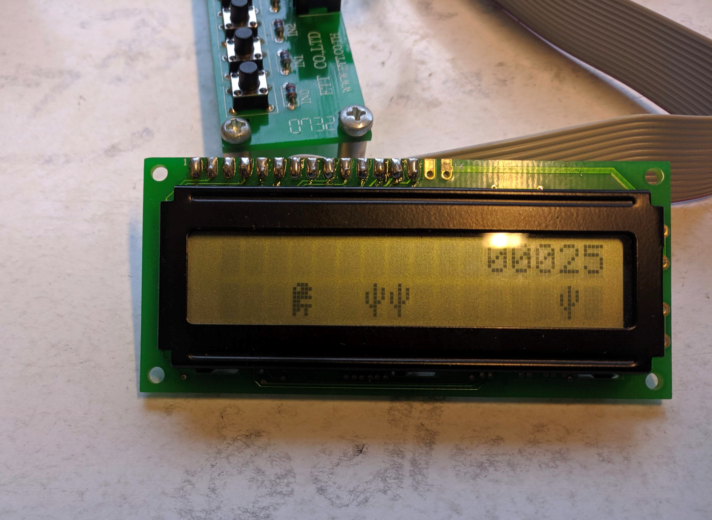

# Dinozavr Game

This project recreates the simplified google chrome jumping dinosaur game on 16x2 LCD display with Hitachi HD44780 controller. The code is 100% written in AVR assembly for the ATmega128 8bit microcontroller.

## Electronics
* Microcontroller: [Microchip ATmega128 8-bit AVR](https://www.microchip.com/wwwproducts/en/ATMEGA128)
* Development board: [ATMEGACONT128](https://futurlec.com/ATMEGA_Controller.shtml)
* Display: [DEVLCD (HD44780 compatible)](https://www.futurlec.com/DevBoardAccessories.shtml)
* Button panel: [Input Test Board](https://futurlec.com/Input_Pushbutton.shtml)

## Pins
* Display: ET-CLCD (see board details)
* Button IN0: GPIO C0

## Game Logic

Game starts on 500ms tick basis and gets progressively faster over time. Each tick cactuses move to the left by 1 tile and score is increased by 1. Tick speed is increased by 2ms each time the game score is divisible by 5.

In the beginning the distance between cactuses is 5 tiles and gets decreased to 4 with score 200 and to 3 with score 400. Double cactuses ignore this limit.

Game is played by avoiding hitting and falling on a cactus by jumping. Player jumps by pressing the IN0 button on the button panel. Each jump always takes exactly 3 game ticks.

Game randomisation is based on pseudorandom Lehmer congruential generator. For each newly added tile there is 30% chance for a single and 15% for a double cactus

## Development
Created using [Atmel Studio 7](https://www.microchip.com/mplab/avr-support/atmel-studio-7), simply import the project and assemble away.
